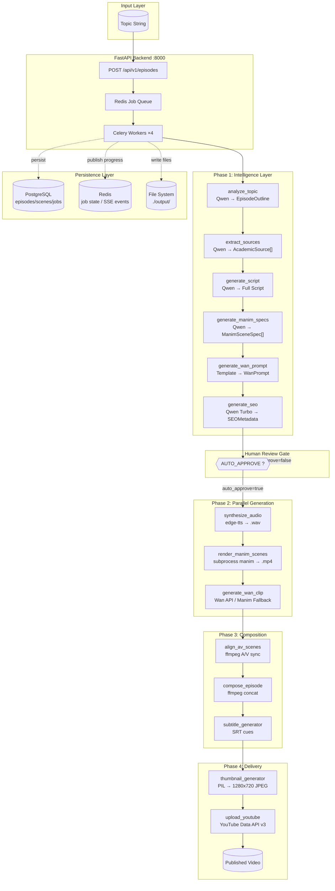
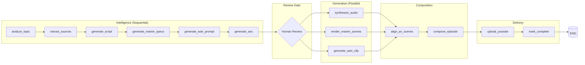

# Quantifaya AutoDirector

**Autonomous AI Showrunner for Financial Engineering Education**

[](https://github.com/Godwin-88/autodirector)
[](https://python.org)
[](https://fastapi.tiangolo.com)
[](https://dashscope.aliyuncs.com)
[](https://langchain-ai.github.io/langgraph)
[](https://www.manim.community)
[](https://docker.com)

---

## Table of Contents

- [Overview](#overview)
- [Architecture](#architecture)
- [File Tree](#file-tree)
- [API Endpoints](#api-endpoints)
- [Quick Start](#quick-start)
- [Configuration](#configuration)
- [Running Tests](#running-tests)
- [Pipeline Flow](#pipeline-flow)

---

## Overview

**Quantifaya AutoDirector** is a production-grade autonomous video generation pipeline that takes a **topic string** as input and outputs a **fully rendered, uploaded YouTube video** with zero human intervention between them.

### Capability Domains

| Domain | Technology | Function |
|--------|-----------|----------|
| **Intelligence** | Qwen Cloud API (`qwen-max`, `qwen-turbo`) | Script generation, source mining, SEO |
| **Generation** | Wan/HappyHorse API, Manim, edge-tts | Video footage, math animations, voice-over |
| **Orchestration** | LangGraph + Celery + Redis | Directed graph, async jobs, error recovery |
| **Delivery** | ffmpeg, YouTube Data API v3, PIL | Composition, upload, thumbnails |

### Key Differentiators

1. **Mathematical accuracy** — Manim renders verified LaTeX that no diffusion model can produce
2. **Persona fidelity** — Qwen writes in the Taylor+Axe+Taleb persona
3. **Academic sourcing** — Real cited sources per scene, not hallucinated
4. **Production system** — Real episodes for a real YouTube channel

---

## Architecture

### System Architecture Diagram



### LangGraph Pipeline DAG



---

## File Tree

```
quantifaya-autodirector/
├── README.md
├── docker-compose.yml
├── .env.example
│
├── backend/
│   ├── main.py                         # FastAPI app entrypoint
│   ├── requirements.txt                # Python dependencies
│   ├── Dockerfile                      # Container build
│   │
│   ├── api/routes/
│   │   ├── episodes.py                 # CRUD for episodes
│   │   ├── health.py                   # Health checks (DB, Redis, Qwen)
│   │   └── stream.py                   # SSE progress streaming
│   │
│   ├── core/
│   │   ├── brand.py                    # Brand color constants
│   │   ├── config.py                   # Pydantic Settings (env vars)
│   │   ├── database.py                 # SQLAlchemy async engine
│   │   ├── redis_client.py             # Async Redis client
│   │   └── logging.py                  # structlog configuration
│   │
│   ├── models/
│   │   ├── episode.py                  # Episode SQLAlchemy model
│   │   ├── scene.py                    # Scene model (FK→episode)
│   │   └── job.py                      # Job model (FK→episode)
│   │
│   ├── schemas/
│   │   ├── episode_outline.py          # EpisodeOutline, SceneOutlineItem
│   │   ├── source.py                   # AcademicSource, SourcesPackage
│   │   ├── manim_spec.py              # ManimSceneSpec, EquationSpec
│   │   ├── seo.py                      # SEOMetadata, ChapterMark
│   │   └── episode_state.py           # LangGraph EpisodeState TypedDict
│   │
│   ├── services/
│   │   ├── intelligence/
│   │   │   ├── qwen_client.py          # AsyncOpenAI wrapper (qwen-max/turbo)
│   │   │   ├── persona.py              # Quantifaya persona system prompt
│   │   │   ├── outline_generator.py    # Topic → EpisodeOutline
│   │   │   ├── source_extractor.py     # Scene → AcademicSource[]
│   │   │   ├── script_generator.py     # Outline+Sources → Full Script
│   │   │   ├── manim_spec_generator.py # Scene → ManimSceneSpec
│   │   │   ├── wan_prompt_generator.py # Episode → Wan prompt
│   │   │   └── seo_generator.py        # Outline → SEOMetadata
│   │   │
│   │   ├── generation/
│   │   │   ├── wan_client.py           # Wan/HappyHorse API wrapper
│   │   │   ├── wan_fallback.py         # Manim title card fallback
│   │   │   ├── manim_codegen.py        # Jinja2 + Qwen code generation
│   │   │   ├── manim_renderer.py       # subprocess manim orchestrator
│   │   │   ├── equation_validator.py   # LaTeX validation & fix
│   │   │   ├── tts_synthesizer.py      # edge-tts voice synthesis
│   │   │   └── av_aligner.py           # ffmpeg A/V duration alignment
│   │   │
│   │   ├── composition/
│   │   │   ├── scene_syncer.py         # Parallel scene A/V sync
│   │   │   ├── episode_compositor.py   # ffmpeg concat manifest
│   │   │   └── subtitle_generator.py   # SRT from voiceover
│   │   │
│   │   └── delivery/
│   │       ├── thumbnail_generator.py  # PIL 1280x720 thumbnail
│   │       └── youtube_uploader.py     # YouTube Data API v3
│   │
│   ├── orchestration/
│   │   ├── state.py                    # EpisodeState TypedDict
│   │   ├── nodes.py                    # 14 async node functions
│   │   └── graph.py                    # LangGraph StateGraph
│   │
│   └── workers/
│       ├── celery_app.py               # Celery configuration
│       └── tasks.py                    # run_episode_graph, upload_youtube
│
├── manim_templates/
│   ├── base_template.py.j2            # Full episode compositor
│   ├── equation_reveal.py.j2          # Math equation animations
│   ├── axes_curve.py.j2               # Axis + curve plots
│   ├── two_column.py.j2               # Side-by-side comparisons
│   └── quote_box.py.j2                # Quote/citation scenes
│
├── brand/
│   ├── intro_card.py                  # 5s brand intro (Manim)
│   └── outro_card.py                  # 5s brand outro (Manim)
│
├── tests/
│   ├── conftest.py                    # Test configuration
│   ├── unit/
│   │   ├── test_outline_generator.py  # EpisodeOutline validation
│   │   ├── test_script_generator.py   # Script structure tests
│   │   ├── test_equation_validator.py # LaTeX validation tests
│   │   ├── test_wan_client.py         # Wan API state machine
│   │   └── test_compositor.py         # ffmpeg manifest tests
│   └── integration/
│       └── test_pipeline_e2e.py       # Full intelligence phase E2E
│
├── nginx/
│   └── nginx.conf                     # Reverse proxy config
│
└── output/                            # gitignored — runtime artifacts
    ├── wan/                           # Wan-generated clips
    ├── scenes/                        # Manim scene MP4s
    ├── audio/                         # TTS WAV files
    ├── episodes/                      # Final composed MP4s
    └── thumbnails/                    # YouTube thumbnails
```

---

## API Endpoints

### Health Endpoints

| Method | Endpoint | Description |
|--------|----------|-------------|
| `GET` | `/health` | Service health status |
| `GET` | `/health/db` | PostgreSQL connection test |
| `GET` | `/health/redis` | Redis ping test |
| `GET` | `/health/qwen` | Qwen API minimal completion test |

**Example:**
```bash
curl http://localhost:8000/health
# → {"status": "ok", "version": "1.0.0"}
```

### Episode Endpoints

| Method | Endpoint | Description |
|--------|----------|-------------|
| `POST` | `/api/v1/episodes` | Create episode & enqueue generation |
| `GET` | `/api/v1/episodes` | List episodes (paginated) |
| `GET` | `/api/v1/episodes/{id}` | Get episode details + scenes |
| `GET` | `/api/v1/episodes/{id}/script` | Get generated script JSON |
| `POST` | `/api/v1/episodes/{id}/resume` | Resume from human review gate |
| `DELETE` | `/api/v1/episodes/{id}` | Cancel and delete episode |

### Create Episode

```bash
curl -X POST http://localhost:8000/api/v1/episodes \
  -H "Content-Type: application/json" \
  -d '{
    "topic": "Why the Normal Distribution Fails in Finance",
    "episode_number": 1,
    "series": "quantifaya"
  }'
```

**Response (201):**
```json
{
  "episode_id": "a1b2c3d4-...",
  "status": "pending",
  "topic": "Why the Normal Distribution Fails in Finance"
}
```

### Get Episode Status

```bash
curl http://localhost:8000/api/v1/episodes/a1b2c3d4-...
```

**Response:**
```json
{
  "id": "a1b2c3d4-...",
  "topic": "Why the Normal Distribution Fails in Finance",
  "status": "scripted",
  "script": { ... },
  "scenes": [
    {
      "id": "...",
      "scene_number": 1,
      "scene_class": "SceneColdOpen",
      "status": "pending"
    }
  ]
}
```

### Resume After Human Review

```bash
curl -X POST http://localhost:8000/api/v1/episodes/a1b2c3d4.../resume
```

### Streaming Progress (SSE)

```bash
curl -N http://localhost:8000/api/v1/stream/a1b2c3d4.../progress

# Event stream:
# event: progress
# data: {"phase": "outlined", "node": "analyze_topic", "progress_pct": 5, "message": "Completed: analyze_topic"}
```

---

## Quick Start

### Prerequisites

- Python 3.11+
- Docker & Docker Compose
- Qwen Cloud API key ([get one here](https://dashscope.aliyuncs.com))
- (Optional) Wan/HappyHorse API key
- (Optional) YouTube Client Secrets

### 1. Clone & Setup

```bash
git clone https://github.com/Godwin-88/autodirector.git
cd autodirector

# Create virtual environment
python3 -m venv .venv
source .venv/bin/activate

# Install dependencies
pip install -r backend/requirements.txt
```

### 2. Configure Environment

```bash
cp .env.example .env
# Edit .env with your API keys:
# QWEN_API_KEY=sk-your-key-here
# WAN_API_KEY=your-key-here
```

### 3. Start Infrastructure

```bash
docker compose up -d postgres redis
```

### 4. Run Database Migrations

```bash
cd backend
source ../.venv/bin/activate
python -m alembic upgrade head
```

### 5. Start the API

```bash
cd backend
source ../.venv/bin/activate
uvicorn main:app --reload --port 8000
```

### 6. Create an Episode

```bash
curl -X POST http://localhost:8000/api/v1/episodes \
  -H "Content-Type: application/json" \
  -d '{"topic": "The Black-Scholes Model", "episode_number": 1}'
```

---

## Running Tests

```bash
# Unit tests (no external dependencies)
source .venv/bin/activate
pytest tests/unit -v

# Integration tests (requires live Qwen API key)
pytest tests/integration -v

# All tests
pytest tests/ -v
```

---

## Configuration

All configuration via environment variables (see `.env.example`):

| Variable | Required | Default | Description |
|----------|----------|---------|-------------|
| `QWEN_API_KEY` | **Yes** | — | Qwen Cloud API key |
| `QWEN_BASE_URL` | No | `https://dashscope.aliyuncs.com/compatible-mode/v1` | Qwen API endpoint |
| `WAN_API_KEY` | No | `""` | Wan/HappyHorse API key |
| `POSTGRES_HOST` | No | `postgres` | PostgreSQL host |
| `POSTGRES_PORT` | No | `5432` | PostgreSQL port |
| `REDIS_URL` | No | `redis://redis:6379/0` | Redis connection URL |
| `AUTO_APPROVE` | No | `false` | Skip human review gate |
| `MANIM_WORKERS` | No | `4` | Parallel Manim render count |
| `MANIM_QUALITY` | No | `h` | Manim quality (h/m/l) |
| `LOG_LEVEL` | No | `INFO` | Logging verbosity |

---

## Pipeline Flow

```
INPUT: "Heston Stochastic Volatility Model"
  │
  ▼
┌─────────────────────────────────────────────────────────────┐
│ PHASE 1: INTELLIGENCE                              ~5 min   │
│                                                              │
│  1.1 Topic Analysis → 10-scene outline                       │
│  1.2 Source Mining → Heston (1993), Gatheral (2006)...       │
│  1.3 Script Generation → 25-min full script in persona       │
│  1.4 Scene Decomposition → Manim scene specs with LaTeX      │
│  1.5 Storyboard → Wan character intro prompt                 │
│  1.6 SEO Generation → Title, tags, chapters, description     │
└──────────────────────────┬──────────────────────────────────┘
                           │
                  ┌────────▼────────┐
                  │ HUMAN REVIEW    │ ← Script preview, approve/edit
                  │ GATE (optional) │
                  └────────┬────────┘
                           │
  ┌────────────────────────▼──────────────────────────────┐
  │ PHASE 2: PARALLEL GENERATION                 ~25 min   │
  │                                                         │
  │  [A] Wan API → 8s character intro clip (or Manim card) │
  │  [B] Manim render → 10 scene MP4s (parallel, 4 workers)│
  │  [C] edge-tts → 10 scene WAV files (parallel)         │
  └────────────────────────┬───────────────────────────────┘
                           │
  ┌────────────────────────▼──────────────────────────────┐
  │ PHASE 3: COMPOSITION                          ~10 min   │
  │                                                         │
  │  3.1 Sync each scene's audio to video (per-scene)      │
  │  3.2 Prepend brand intro (5s) + Wan clip               │
  │  3.3 Append brand outro (5s)                           │
  │  3.4 Generate subtitles and chapter markers            │
  │  3.5 Export final 1080p60 MP4                          │
  └────────────────────────┬───────────────────────────────┘
                           │
  ┌────────────────────────▼──────────────────────────────┐
  │ PHASE 4: DELIVERY                              ~2 min   │
  │                                                         │
  │  4.1 Generate 1280×720 thumbnail (PIL)                 │
  │  4.2 Upload to YouTube (unlisted) with metadata        │
  │  4.3 Set thumbnail via YouTube API                     │
  │  4.4 Log youtube_id in PostgreSQL                      │
  └─────────────────────────────────────────────────────────┘

OUTPUT: https://youtube.com/watch?v={youtube_id}
```

---

## Tech Stack

```
┌───────────────────────────────────────────────────────────┐
│ Layer            │ Technology           │ Purpose          │
├──────────────────┼──────────────────────┼──────────────────┤
│ Orchestration    │ LangGraph (Python)   │ Agentic DAG      │
│ LLM              │ Qwen Cloud API       │ Script + SEO gen │
│ Video Gen        │ Wan/HappyHorse API   │ Character footage│
│ Math Animation   │ Manim Community v0.20│ Scene rendering  │
│ Voice            │ edge-tts             │ Voice synthesis  │
│ Composition      │ ffmpeg               │ A/V stitching    │
│ Backend          │ FastAPI (Python)     │ REST API layer   │
│ Queue            │ Redis + Celery       │ Async job mgmt   │
│ Database         │ PostgreSQL 16        │ State persistence│
│ Thumbnail        │ PIL/Pillow           │ Image generation │
│ Upload           │ YouTube Data API v3  │ Auto-publishing  │
│ Infra            │ Docker Compose       │ Local + Cloud    │
└───────────────────────────────────────────────────────────┘